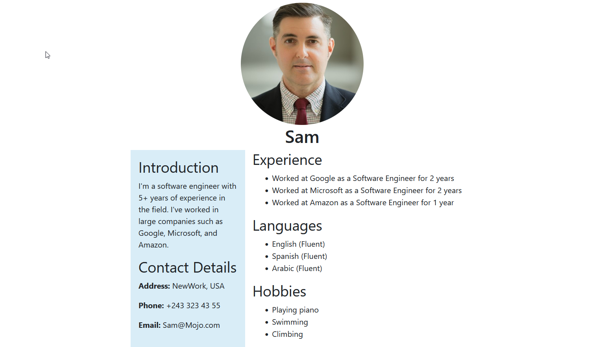

# ProtfolioGPT

Generate a Protfolio website using ChatGPT.

### Generated example

Input:

My name is Sam, I'm a software engineer, I've 5+ years experince in the field.
\
I've worked in large companies such as Google, Microsoft,and Amazon.
\
I can speak three languages fluently: English, Spanish, and Arabic.
\
For my hobbies: Playing piano, Swimming,and Climbing.
\
My address: NewWork, USA.
\
Phone number: +243 323 43 55
\
Email: Sam@Mojo.com
\
Profile picture: https://www.wilsoncenter.org/sites/default/files/styles/large/public/media/images/person/james-person-1.jpg

Output:

## Running the application

- Get ChatGPT API key.
- Create 'keys.txt' file in the repo directory.
- Run 'Python WebsiteGenerator.py'

Note: Sometimes ChatAPT doesn't provide quality website, so you try few times to get a good one.

## Conributions

Conributions are welcome, you can send me a message or open an issue.
